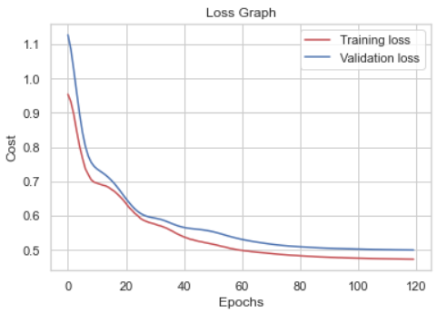
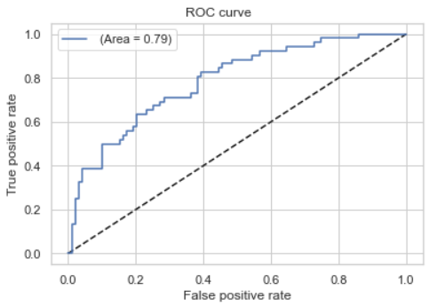

# Diabetes Detector 

En este proyecto se realizará una red neuronal sintética que permita la detección de diabetes en pacientes, basándose para esto en el dataset: "Pima Indians Diabetes Dataset". Se implementan de esta manera dos clasificadores:

- Clasificador de Diabetes utilizando regresión logística + Features Polinomiales. 

- Clasificador de Diabetes utilizando un MLP (Multilayer Perceptron). Para esto se desarrollan diferentes modelos de la red variando en cada modelo la cantidad de capas y la cantidad de neuronas en cada capa.

En todos los casos de estudio la métrica principal será el area bajo la curva ROC, y se busca además el umbral para la clasificación de forma tal que de maximizar el F2 score.

Luego se informan las siguientes métricas secundarias.

*   Especificidad
*   Sensibilidad
*   Valor Predictivo Positivo
*   Valor Predictivo Negativo

---

## Resultados

De esta manera se pudo obtener que en ninguno de los casos analizados con MultiLayer se obtuvieron mejores resultados que los obtenidos anteriormente utilizando regresión logística por lo tanto utilizamos un sistema de una sola neurona (regresión logística). Así, se opta por seleccionar al modelo final con los siguientes hiperparámetros:

- Reemplazo de valores nulos por la mediana.
- Eliminación de columnas Age y SkinThickness.
- PolynomialFeatures.
- Grado de PolynomialFeatures: 4.
- Learning Rate: 0.0001
- Learning Rate Decay: 0.0001
- Momentum: 0.99
- Regularización L2.

### Gráficos obtenidos para la selección de los hiperparámetros.

  
   
  Figura 1: Loss Graph

  
   
  Figura 2: ROC curve

Nota: Es muy probable que debido al tamaño del archivo diabetes_detector.ipynb, el proceso de carga en la visualización rápida de github tarde demasiado o no cargue las imágenes asociadas, por esta razón se deja una imágen del comportamiento de la red neuronal en la configuración elegida y se invita al lector a descargar la notebook para verla de mejor manera de forma local en su computadora, donde se podrán ver los gráficos sin inconvenientes.

---

###  Métricas Finales:

- AUC: 0.794017094017094
- Especificidad: 0.9111111101907967
- Sensibilidad: 0.4192307684245562
- PPV: 0.7135252108617769
- NPV: 0.74913228581085