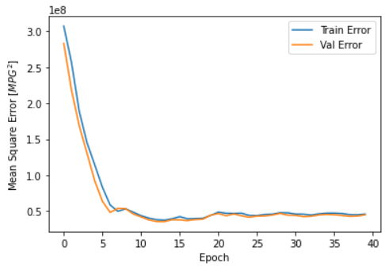
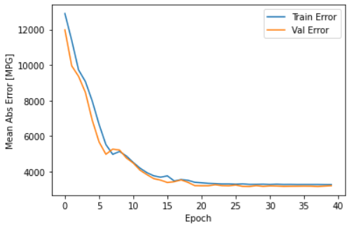
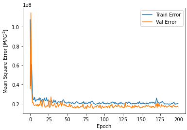
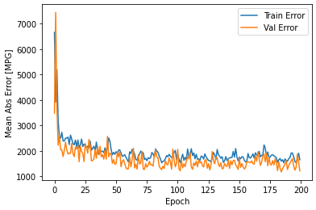

# Insurance cost estimator

En este trabajo se utiliza una base de datos con los costos de la atención médica de pacientes. El objetivo es realizar una estimación del costo de la atención para un paciente dado. 

Para esto primero se hace un breve análisis y limpieza de los datos presentes en el dataset, para luego realizar una comparativa entre las siguientes configuraciones de la red, primero se busca el conjunto de hiperparámetros que mejor se ajusta a la red para luego comparar en base a la mejor versión de la red en cada una de las opciones. En cada una de las opciones se separa el dataset en un set de train, validación y testeo.

<ol start = "1">
  <li> Regresión lineal </li>
  <li> Regresión lineal + features polinomiales </li>
  <li> Regresión utilizando MLP </li>
    <ul type="none">
      <li> Donde:</li>
        <ul>
            <ul type="circle">
            </ul>
          <li> Se contemplan diferentes configuraciónes para los siguientes parámetros de Topología e Hiperparámetros </li>
            <ul type="circle">
              <li> Cantidad de capas </li>
              <li> Cantidad de neuronas por capa </li>
              <li> Funciones de activación </li>
              <li> Optimizadores (tipos, learning rate y beta)</li>
            </ul>
          <li> Se Monitorea la evolución de la red con tensorboard </li>
        </ul>
    </ul>
</ol>

En todos los casos se trabaja con una misma clase llamada k_folding definida dentro del archivo insurance.ipynb, que nos permite trabajar en cualquiera de las 3 configuraciones de la red, según los parámetros que se ingresen en la función. 

La métrica utilizada para este trabajo es el Mean Absolute Error (MAE).

---

## Regresión lineal

Se implementa una regresión lineal para la predicción del costo de atención medica de un paciente, de esta manera se obtiene la siguiente configuración para la red:

| Layer (type)     | Output Shape | Param # |
|------------------|--------------|---------|
| dense_18 (Dense) | (None,1)     | 10      |
| dense_19 (Dense) | (None, 1)    | 2       |

Por lo que el tamaño de la red queda así:

<ul type="none">
<li>Total Params: 12</li>
<li>Trainable Params: 12</li>
<li>Non-Trainable Params: 0</li>
</ul>

Sobre la misma se realizaron validaciones con diferentes conjuntos de hipérparametros, para luego se realizó una comparación entre las diferentes configuraciones de la red. Se analizó la cantidad de EPOCHs, learning rate, beta 1 y beta 2 estos ultimos, correspondientes a las constantes que se utilizan para el optimizador Adam.

De esta manera se seleccionaron los siguiente hiperparámetros:

- Número de EPOCHs: 100
- Learning rate: 1
- Beta 1: 0.99
- Beta 2: 0.99999

De esta manera se pudo encontrar los siguientes valores de MSE y MAE en train y validación:

|  Métrica  |     Train    | Validación |   Test   |
|-----------|--------------|------------|----------|
|    MSE    |   37006104   |  36955756  | 62286404 |
|    MAE    |     3242.1   |    3235.7  |   4101.9 |

Podemos ver que las métricas empeoran considerablemente al pasar a test, y si bien es normal que las métricas empeoren un poco en el caso de test, esta diferencia indicaría que algo no funciona como debería, probablemente el seteo de los hiperparámetros se adapta demasiado bien a validación y train pero no al set test.

A continuación se muestran los graficos de los MSE y MAE en función del número de EPOCHs:

  
   
  Figura 1: MSE vs EPOCHs

  
   
  Figura 1: MAE vs EPOCHs

## Regresión lineal + features polinomiales

En esta sección se muestran los resultados obtenidos despues de realizar una regresión lineal con features polinomiales para distintos grados del polinómio.

### Grado 1:

|  Métrica  |     Train    | Validación |
|-----------|--------------|------------|
|    MSE    |   37006104   |  36955756  |
|    MAE    |     3242.1   |    3235.7  |

### Grado 2:

|  Métrica  |     Train    | Validación |
|-----------|--------------|------------|
|    MSE    |   68638677   |  71394753  |
|    MAE    |     3250.5   |    3289.3  |

### Grado 3:

|  Métrica  |     Train    | Validación |
|-----------|--------------|------------|
|    MSE    |   84789277   |   89120612 |
|    MAE    |     4603.4   |     4709.7 |

### Grado 4:

|  Métrica  |     Train    | Validación |
|-----------|--------------|------------|
|    MSE    |   197222820  |  195305346 |
|    MAE    |      642     |    6443    |

Se puede ver que el uso de features polinomiales no ayuda de mucho a la resolución de nuestra red neuronal ya que al aumentar el grado del polinomio no se aprecian mejoras en los resultados obtenidos.

## MLP (Multi-Layer Perceptron)

Se implementa una red neuronal MLP para la predicción del costo de atención medica de un paciente, de esta manera se realiza un analisis de las diferentes configuraciones de la red teniendo en cuenta los resultados que arroja la red luego de ser evaluadas las validaciones con diferentes conjuntos de hipérparametros, tales como: la cantidad de EPOCHs, learning rate, beta 1 y beta 2 estos ultimos, correspondientes a las constantes que se utilizan para el optimizador Adam.

De esta manera se  llega a la siguiente tabla que resume la configuración de la red elegida.

| Layer (type)                   |Output Shape|Param #|      Connected to     |
|--------------------------------|------------|-------|-----------------------|
| categorical input (InputLayer) | [(None,1)] |   0   |                       |
| Embedding_layer (Embedding )   |[(None,1,2)]|   8   |categorical input[0][0]|
| Flatten (Flatten)              | [(None,2)] |   0   | Embedding_layer[0][0] |
| numerical input (InputLayer)   | [(None, 5)]|   0   |                       |
| Concatenated (Concatenate)     |  (None, 7) |   0   |Flatten[0][0]; numerical input[0][0] |
| Dense_1 (Dense)                |  (None, 40) | 320  |Concatenated[0][0]     |
| Dense_2 (Dense)                |  (None, 40) | 1640 |Dense_1[0][0]          |
| output (Dense)                 |  (None, 1)  |  41  |Dense_2[0][0]          |

Por lo que el tamaño de la red queda así:

<ul type="none">
<li>Total Params: 2009</li>
<li>Trainable Params: 2009</li>
<li>Non-Trainable Params: 0</li>
</ul>

Para este caso se seleccionaron los siguientes hiperparámetros como configuración de la red:

- Número de EPOCHs: 200
- Learning rate: 1
- Beta 1: 0.9
- Beta 2: 0.999
- Número de neuronas en la primer capa = 40
- Número de neuronas en la segunda capa = 40

De esta manera se pudo encontrar los siguientes valores de MSE y MAE en train y validación:

|  Métrica  |     Train    | Validación |   Test   |
|-----------|--------------|------------|----------|
|    MSE    |   18825965   |  17859164  | 31971606 |
|    MAE    |     1517     |    1489    |   2161   |

A continuación se muestran los graficos de los MSE y MAE en función del número de EPOCHs para este caso:

  
   
  Figura 1: MSE vs EPOCHs

  
   
  Figura 1: MAE vs EPOCHs

Es importante notar que si bien la red neuronal con 100 neuronas en cada capa funciona mejor que la elegida (40 neuronas por capa), la diferencia es pequeña y la diferencia en nivel de procesamiento y tiempos de ejecución es mucho mayor para la red con 100 neuronas, por lo que aún cuando la opción con 100 neuronas por capa puede entregar mejores valores de MSE y MAE, no es recomendable utilizarla ya que el procesamiento es más lento y el tiempo de ejecución es mucho mayor que en la red con 40 neuronas por capa.

---

## Conclusión:

Se puede observar de los resultados obtenidos que para esta situación una red neuronal MLP funciona mucho mejor que una regresión lineal y que una relación lineal con features polinomiales, ya que los valores de MAE y MSE (la métrica elegida es el MAE igualmente), son menores en esta configuración que en la mejor combinación de las demás.

Esto se explica debido q que la red neuronal MLP tiene una mayor capacidad de aprendizaje y aunque esto implique que es más difícil de entrenar, en esta condición se prefiere por sobre las demás opciones debido a la mejora significativa en rendimiento que genera.
