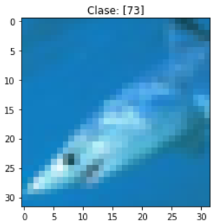

# Clasificador de Imágenes

En este proyecto se implementan 3 clasificadores de imágenes en 100 categorías diferentes a partir del set de datos CIFAR-100. Para ello cada uno de los archivos implementa una red neuronal del tipo CNN (Convolutional Neural Network). Cada una de las configuraciones planteadas se muestran en diferentes archivos Jupyter Notebook. 

---

## Descripción del dataset

El dataset presenta 600 imágenes de 32x32 píxeles a color para cada categoría, de las cuales se suele testeo.

En la imágen de la figura 1 se puede ver un ejemplo de una imágen de un tiburón que se encuentra presente dentro del dataset.

  
   
  Figura 1: ejemplo de imágen en CIFAR-100

Algunas de las 100 clasificaciónes se muestran a continuación en la siguiente tabla, la lista completa se la puede encontrar en el siguiente [enlace](https://www.cs.toronto.edu/~kriz/cifar.html).

 

| Superclass                     	| Classes                                               	|
|--------------------------------	|-------------------------------------------------------	|
| fish                           	| aquarium fish, flatfish, ray, shark, trout            	|
| flowers                        	| orchids, poppies, roses, sunflowers, tulips           	|
| fruit and vegetables           	| apples, mushrooms, oranges, pears, sweet peppers      	|
| household electrical devices   	| clock, computer keyboard, lamp, telephone, television 	|
| insects                        	| bee, beetle, butterfly, caterpillar, cockroach        	|
| large carnivores               	| bear, leopard, lion, tiger, wolf                      	|
| people                         	| baby, boy, girl, man, woman                           	|
| trees                          	| maple, oak, palm, pine, willow                        	|
| vehicles 1                     	| bicycle, bus, motorcycle, pickup truck, train         	|

 

---

## Archivos

A continuación se listan los archivos que se encuentran dentro de este proyecto con una breve descripción de cada uno de ellos:

- simple_image_clasifier.ipynb: Clasificador de imágenes que implementa una red neuronal de baja complejidad (1,777,636 trainable parameters) y reducido tiempo de entrenamiento que logra un accurasy de valor 0.483 en el set de testeo a partir de clasificar las imágenes en cada categoría.

- complex_image_clasifier.ipynb: Clasificador de imágenes que implementa una red neuronal con 15,047,588 de parámetros entrenables que logra un accurasy de valor 0.629 en el set de testeo en la clasiificación de imágenes en 100 categorías.

- image_classifier_with_transfer_learning.ipynb: Clasificador de imágenes que implementa una red neuronal con transfer learning utilizando los datos de EfficientNetB0 para agilizar el proceso de entrenamiento. De esta manera se entrena la red que fue pre-entrenada por lo que se empiza con los valores que presenta la red EfficientNetB0. A partir de implementar esta red se pudo lograr un accurasy en el set de testeo de valor 0.797 en la separación de las imágenes en las 100 categorías.

A continuación se muestra un resumen correspondiente a cada una de las redes neuronales que se implementan en cada uno de los archivos comentados:

---

## Simple Image Clasifier

En esta sección se detalla la configuración utilizada en la red neuronal implementada en el archivo simple_image_clasifier.ipynb.

Dentro del archivo Jupyter Notebook se puede ver que la red consta de 4 capas convolucionales con MaxPooling y 3 capas densas.

Dentro también se implementa un Dropout para evitar overfitting. y batch normalization para aumentar la velocidad de aprendizaje a partir de normalizar la salida de cada capa convolucional. Tambien se implementa un global average pooling para reducir el tamaño de la imagen a una dimensión.

Como función de activación se utiliza primero en las ultimas 2 capas densas la función de activación relu y luego softmax para que la red clasifique las imágenes en 100 categorías.

Como métrica del modelo se utiliza el accuracy y como optimizador se utiliza el Adam con un learning rate de 0.001 y como funcion de costo se utiliza categorical cross entropy.

Previo al entrenamiento se implementa Data augmentation para aumentar la cantidad de datos que se utilizan para entrenar la red, para eso se realiza un horizontal flip sobre las imágenes y un shift range horizontal y vertical de valor 0.1.

| Layer (type)                | Output Shape      |        Param #    	|
|-----------------------------|-------------------|-------------------	|
| conv2d_5 (Conv2D)           | (None, 30, 30, 64)|        1792       	|
| dropout_3 (Dropout)         | (None, 30, 30, 64)|        0          	|
| batch_normalization_1 (Batch| (None, 30, 30, 64)|        256        	|
| conv2d_6 (Conv2D)           | (None, 28, 28, 128)|       73856      	|
| max_pooling2d_2 (MaxPooling2| (None, 14, 14, 128)|       0          	|
| dropout_4 (Dropout)         | (None, 14, 14, 128)|       0          	|
| batch_normalization_2 (Batch| (None, 14, 14, 128)|       512        	|
| conv2d_7 (Conv2D)           | (None, 12, 12, 256)|       295168     	|
| max_pooling2d_3 (MaxPooling2| (None, 6, 6, 256)  |       0          	|
| dropout_5 (Dropout)         | (None, 6, 6, 256)  |       0          	|
| batch_normalization_3 (Batch| (None, 6, 6, 256)  |       1024       	|
| conv2d_8 (Conv2D)           | (None, 4, 4, 512)  |       1180160    	|
| batch_normalization_4 (Batch| (None, 4, 4, 512)  |       2048       	|
| global_average_pooling2d_1 (| (None, 512)        |       0          	|
| dropout_6 (Dropout)         | (None, 512)        |       0          	|
| dense_3 (Dense)             | (None, 256)        |       131328     	|
| dense_4 (Dense)             | (None, 256)        |       65792      	|
| dense_5 (Dense)             | (None, 100)        |       25700      	|

- Total params: 1,777,636                                           	
- Trainable params: 1,775,716                                       	
- Non-trainable params: 1,920                                       	

Con esta red se pudo clasificar las imágenes en 100 categorías con un accurasy de valor 0.483 en el set de testeo, luego de aproximadamente 80 minutos de entrenamiento.

---

## Complex Image Clasifier

Con la finalidad de obtener un mejor resultado en el set de testeo se implementa en el archivo complex_image_clasifier.ipynb una red neuronal con 15,047,588 de parámetros entrenables que logra un accurasy de valor 0.629 en el set de testeo en la clasiificación de imágenes en 100 categorías. Para esto la red integra 12 capas convolucionales con MaxPooling y 2 capas densas.

Dentro también se implementa un Dropout para evitar overfitting. y batch normalization para aumentar la velocidad de aprendizaje a partir de normalizar la salida de cada capa convolucional, un regularizador L2 para evitar que las capas densas sean tan dependientes entre sí. se utiliza como función de activación intermedia una relu y como función de activación final una softmax.

Debido a que la red es mas compleja entonces es provechoso poseer un dataset con mayor cantidad de datos para la clasificación, es por esto que se realiza data augmentation como en el caso anterior pero esta vez ademas de flipear horizontalmente e implementar un width shift range de 0.1 y un height shift range de 0.1, se implementa un rango de rotación de 15 grados, para que las imágenes puedan rotar un poco su posición.

Como optimizador se utiliza sgd (stochastic gradient descent) con un learning rate de 0.1, implementando a su vez un learning rate scheduler de tipo exponential decay para que el learning rate disminuya gradualmente. el momentum del SGD es de 0.9. Como funcion de costo se utiliza categorical cross entropy y la métrica de evaluación es el accuracy al igual que el caso anterior.

La tabla con la lista de parámetros entrenables de la red se puede ver en el archivo complex_image_clasifier.ipynb, no se muestra acá debido a que es demasiado grande, sólo se detallan a continuación el número de parámetros que se utilizan en la red.

- Total params: 15,047,588                                           	
- Trainable params: 15,038,116                                      	
- Non-trainable params: 9,472                                      	

Con esta red se pudo clasificar las imágenes en 100 categorías con un accurasy de valor 0.629 en el set de testeo, luego de aproximadamente 5 horas de entrenamiento.

---

## Image Clasifier with Transfer Learning

Esta red neuronal puede encontrarse en el archivo image_clasifier_transfer_learning.ipynb, esta red fue construida utilizando como base una red neuronal de imagenes previa denominada EfficientNetB0, de esta manera se trabaja con una red pre-entrenada lo que agiliza mucho el proceso de entrenamiento.

La red implementa la misma estructura que la implementada por la EfficientNetB0, importando los pesos provenientes del dataset'imagenet', sobre eso se realiza un global average pooling y una capa densa con una función de activación softmax, ademas de un dropout de valor 0.2.

Al set de testeo se le realiza data aumentation con la finalidad de aumentar la cantidad de datos presentes en train, para esto se realiza un horizontal flip y un width shift de valor 0.5, sumado a un grid distortion de valor 0.2 y un elastic transform de valor 0.2.

Con todo lo anterior, la red termina teniendo la arquitectura que se puede ver en la siguiente tabla.

| Layer (type)                 |Output Shape        |      Param # 	|
|------------------------------|--------------------|-------------	|
| efficientnet-b0 (Functional) |(None, 7, 7, 1280)  |     4049564 	|
| global_average_pooling2d (Gl |(None, 1280)        |     0       	|
| dropout (Dropout)            |(None, 1280)        |     0       	|
| dense (Dense)                |(None, 100)         |     128100  	|

- Total params: 4,177,664                                           	
- Trainable params: 4,135,648                                      	
- Non-trainable params: 42,016

Con esta red se pudo clasificar las imágenes en 100 categorías con un accurasy de valor 0.797 en el set de testeo, luego de aproximadamente 40 minutos de entrenamiento. Lo que muestra las bondades de utilizar una red bien pre-entrenada con otras imágenes para el entrenamiento de la red, ya que disminuye los tiempos necesarios para entrenamiento y aumenta el accuracy resultante.
