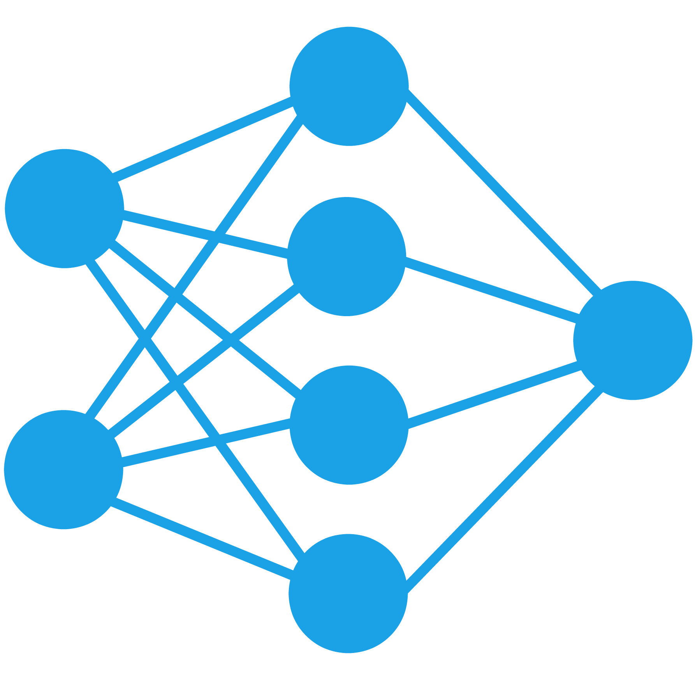

<h1 align="center">
  <br>
  
  <br>
  Neural_Networks
  <br>
</h1>

<p align="center">
  • <a href="#introduccion">Introducción</a> 
  • <a href="#primeros-pasos">Primeros pasos</a> 
</p>

## Introduccion

En este repositorio se encuentran los trabajos realizados para la materia Redes Neuronales de la carrera Ingeniería Electrónica en el Instituto Tecnológico de Buenos Aires (ITBA).

Dentro de este repositorio encontrará una carpeta para cada uno de los trabajos realizados, dentro podrá encontrar un archivo README.md con la descripción detallada del trabajo y un archivo (o varios) del tipo Juptyer Notebook (.ipynb), con el código necesario para ejecutar el trabajo. 

A continuación se hace un breve comentario sobre cada uno de los trabajos:

- Clasificador de Noticias: Dentro de esta carpeta encontrará un proyecto que se encarga de clasificar las noticias de un dataset dentro de 20 categorías diferentes en función del texto que se encuentra en cada noticia.

- Detector de Diabetes: Dentro de esta carpeta encontrará un proyecto que se encarga de predecir la aparición de diabetes en base a diferentes valores del paciente, utilizados para el diagnóstico.

- Detector de Diabetes RN: Dentro de esta carpeta encontrará un proyecto que se encarga de predecir la aparición de diabetes en base a diferentes valores del paciente, utilizados para el diagnóstico. En este caso a diferencia del anterior se implementa el detector con una red neuronal para comprobar la diferencia entre utilizar una red MLP (Multi-Layer Perceptron) o una red con una única neurona (regresión logística).

- Health Care cost estimator: Dentro de esta carpeta encontrará un proyecto que se encarga de estimar el costo de una prestación de salud en base a diferentes valores del paciente, utilizados para el diagnóstico, para esto se utilizan 3 formatos para la red neuronal: 
    - La primer opción implementa una regresión lineal.
    - La segunda opción implementa una red con regresión lineal + features polinomiales
    - La tercera opción implementa una red neuronal con el esquema MLP (Multi-Layer Perceptron).

    De esta manera se contrastan las tres opciones para ver cual es la que mejor se adapta a los datos y mejores resultados entrega.

- Image Classifier: Dentro de esta carpeta encontrará un proyecto que se encarga de clasificar las imágenes de un dataset dentro de 100 categorías diferentes. Para esto implementa 3 redes neuronales convolucionales:
    - La primer opción implementa una red neuronal simple (1,777,636 parámetros) con un tiempo de entrenamiento corto (80 min).
    - La segunda opción implementa una red convolucional más compleja (15,047,588 parámetros), con un tiempo de entrenamiento de más alto (5 hrs).
    - La tercera opción implementa una red convolucional con transfer learning, para eso se basa en los valores preentrenados dentro de cada neurona en la red EfficientNetB0, a partir del dataset 'imagenet'. Esta red utiliza 4,177,664 parámetros y demora aproximadamente 40 minutos en la etapa de entrenamiento.


## Primeros pasos

Los trabajos estan realizados todos dentro de archivos Jupyter Notebooks, cada uno se encuentra en la carpeta del trabajo correspondiente. Algunas notebook son algo extensas y si bien se pueden visualizar dentro del navegador a travez de github, es recomendable correr las notebooks localmente en la computadora ya que desde la interfaz de github en muchas ocaciones las imágenes no cargan debido al tamaño de los archivos Jupyer involucrados.

Para correr localmente las Notebooks correspondientes a los trabajos, primero hay que clonar el repositorio:

```
git clone https://github.com/matifrancois/Neural_Networks.git
```	

Luego se puede correr cada notebook desde la interfaz de Jupyter o utilizando IDEs que permitan la visualización de código escrito en Jupyter Notebooks, como por ejemplo PyCharm o Visual Studio Code (con la extensión Jupyter Notebook).

En el caso de querer correr localmente las notebook se deben instalar las librerías correspondientes en cada caso y descargar los datasets correspondientes que no se incluyen en este repositorio debido al tamaño de dichos archivos.
